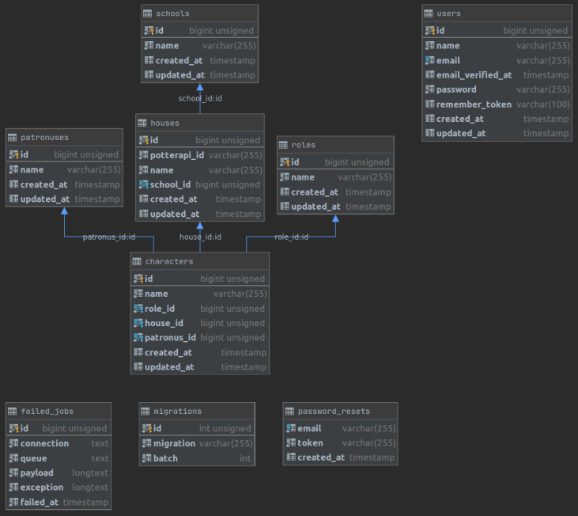
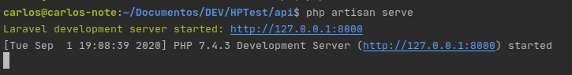

# HPTest
CRUD application about Harry Potter characters.

### 1. Clone

> git clone https://github.com/carlosgcarneiro/HPTest.git

### 2. Install Application
  1. Run composer install to generate depedencies in vendor folder;
  2. Change .env.example to .env;
  3. Run php artisan key:generate;
  4. Configure .env;
  	- POTTER\_API\_KEY, DB\_DATABASE, DB\_USERNAME and DB\_PASSWORD.
  
##### Database Setup

  > php artisan migrate:fresh --seed

This code will generate some default data and a default user:
	e-mail= teste@teste.com and password = '12345678'
	
You can see the database schema:

### 3. Using Application

After install the application, on the project folder, you should run:

>php artisan serve

Later, on your favourite browser, type the url shown on the prompt. As example, on the picture bellow, you should type http://127.0.0.1:8000 .

Now, you just need to log in and use the application.

- When you create a character, you can load the name and the house from www.potterapi.com .

- When you create or edit a house, you can load the name from www.potterapi.com .
